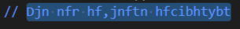
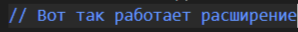
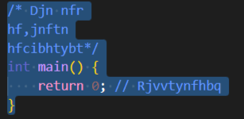
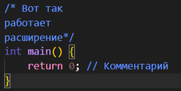
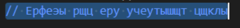
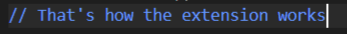
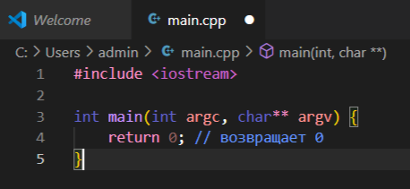

## ***Разработчик:*** Глебова Надежда Максимовна, группа М3103
# **Расширение: _TextReplacer_**
## **Общее описание**
Плагин для редактора кода ***`Visual Studio Code`*** (версия `1.95.0` и выше).
Предоставляет возможности для замены текста, написанного в неправильной раскладке (реализована замена не всех символов).
В плагин входят следующие команды:
- `Replace Text`,
- `Replace Text In Comments`,
- `Replace Russian Text`,

а также отдельная цветовая тема:
- `Eye Comfort Theme`.
## **Описание возможностей расширения**
### **Команды**
#### `Replace Text`
В выделенном фрагменте кода заменяет символы английской раскладки клавиатуры на буквы русской раскладки клавиатуры.

**Способы вызова**

- с использованием палитры команд (Command Palette): `Ctrl` + `Shift` + `P` => `Replace Text`
- по нажатию горячих клавиш: `Ctrl` + `Alt` + `T`

**Примеры вызова**
| Выделение текста: | Результат: |
| - | - |
|  |  |
#### `Replace Text In Comments`
В выделенном фрагменте кода находит однострочные и многострочные комментарии и заменяет в них символы английской раскладки клавиатуры на буквы русской раскладки клавиатуры.

**Способы вызова**

- с использованием палитры команд (***Command Palette***): `Ctrl` + `Shift` + `P` => `Replace Text In Comments`
- по нажатию горячих клавиш: `Ctrl` + `Alt` + `C`

**Примеры вызова**
| Выделение текста: | Результат: |
| - | - |
|  |  |
#### `Replace Russian Text`
В выделенном фрагменте кода заменяет символы русской раскладки клавиатуры на символы английской раскладки клавиатуры.

**Способы вызова**

- с использованием палитры команд (Command Palette): `Ctrl` + `Shift` + `P` => `Replace Russian Text`
- по нажатию горячих клавиш: `Ctrl` + `Alt` + `K`

**Примеры вызова**
| Выделение текста: | Результат: |
| - | - |
|  |  |
### **Темы**
#### `Eye Comfort Theme`
Предоставляет оформление кода в приятных для глаз пастельных оттенках. Описана в файле ***eye-comfort-theme.json***.

**Тип:** тёмная (***dark***)

**Применение**
- с использованием палитры команд (***Command Palette***): `Ctrl` + `Shift` + `P` => `Preferences: Color Theme` => `Eye Comfort Theme`

**Скриншот редактора с примененной `Eye Comfort Theme`**

## **История изменения проекта с хэшами коммитов**

- `77db69f81f43607d0356b6ecd1a5f993933c7381 (origin/main, origin/HEAD)` Create README.md
- `09b90385b29c814ff193c0266454cbea8ccfe18d` default project created
- `b1852c0d17da5fbb9fad817680096249219ab10f` replace text command added
- `3a2454191b734e286fe66c9217884d5736676674` replace text in comments command added
- `5b2a40ca3c5a76be9cc4058518077a5e6c52fd09` hot keys for commands added
- `3067cc965fb2e6f2c005e10c8263cdd2a0ce624a` eye comfort theme added
- `280c676b927f5dd350a45e5b4f431a8144332758 (HEAD -> main)` documentation added